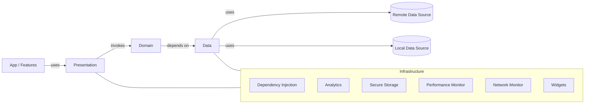

## iOS Clean Architecture Template — Production‑grade Swift foundation

Minimal boilerplate. Maximum clarity. This repository provides a world‑class, modular, and production‑ready iOS template that implements Clean Architecture and SOLID principles with Swift and SwiftUI. It is designed for long‑term maintainability, testability, performance, and security.

- Minimum platforms: iOS 15, macOS 12, tvOS 15, watchOS 8
- Package name: `iOSCleanArchitectureTemplate`
- License: MIT (see `LICENSE`)

---

### Table of Contents
- Why this template?
- Features
- Installation (SPM)
- Quick Start (zero‑to‑value)
- Architecture Overview
- Module Breakdown
- Data flow examples (Domain → Data → Presentation)
- Error handling, logging and observability
- Dependency Injection and configuration
- Concurrency model
- Testing strategy
- Linting and formatting
- Performance and security notes
- Internationalization
- Examples index
- Versioning and changelog
- Contributing, Code of Conduct, Security policy
- Troubleshooting

---

### Why this template?
- Clean boundaries: clear separation of concerns across Domain, Data, Presentation, and Infrastructure.
- Scalable by default: feature modules and protocols make changes safe and localized.
- Testability first: predictable data flows, injectable dependencies, and thorough test targets.
- Production‑ready guardrails: performance, security and analytics hooks built‑in.

### Features
- Clean Architecture + SOLID with well‑defined module boundaries
- Domain‑driven Use Cases and Entities
- Data layer with `Remote` and `Local` data sources and a Repository façade
- Presentation with SwiftUI + MVVM
- Infrastructure utilities: DI, Analytics, Performance, Security, Network monitoring, Widgets
- End‑to‑end examples and comprehensive tests

See documentation for deeper topics:
- Architecture: `Documentation/Architecture.md`, `Documentation/ArchitectureGuide.md`
- SOLID: `Documentation/SOLIDGuide.md`
- Presentation: `Documentation/PresentationAPI.md`
- Data layer: `Documentation/DataAPI.md`
- Infrastructure: `Documentation/InfrastructureAPI.md`
- Performance: `Documentation/Performance.md`
- Analytics: `Documentation/Analytics.md`
- Internationalization: `Documentation/Internationalization.md`
- Getting started: `Documentation/Getting-Started.md`, `Documentation/GettingStarted.md`
- Installation: `Documentation/Installation.md`
- API overview: `Documentation/API.md`, `Documentation/API-Reference.md`
- Troubleshooting: `Documentation/Troubleshooting.md`

### Installation (Swift Package Manager)
Add the package in Xcode:
- File → Add Packages… → enter:
```
https://github.com/muhittincamdali/ios-clean-architecture-template.git
```
Or in your `Package.swift`:
```swift
dependencies: [
  .package(url: "https://github.com/muhittincamdali/ios-clean-architecture-template.git", from: "1.0.0")
]
```

### Quick Start (zero‑to‑value)
Import and compose the building blocks. Prefer constructing concrete dependencies at the edge and pass protocols inward.

```swift
import iOSCleanArchitectureTemplate

// Domain use cases (interfaces live under Sources/Domain/Protocols)
// Compose repository with local/remote data sources (concrete implementations under Sources/Data)
// Then inject into your ViewModel in Presentation.
```

For complete, runnable flows, see `Examples/` (list below) and test targets in `Tests/`.

### Architecture Overview


- Presentation = SwiftUI Views + ViewModels (MVVM)
- Domain = Entities + UseCases + Protocols (pure business rules)
- Data = Repositories + Local/Remote DataSources (adapters)
- Infrastructure = System services, DI, analytics, security, performance, etc.

### Module Breakdown (source highlights)
- Domain (`Sources/Domain/`)
  - Entities: `Sources/Domain/Entities/User.swift`
  - Use Cases: `Sources/Domain/UseCases/GetUsersUseCase.swift`, `Sources/Domain/UseCases/GetUserUseCase.swift`
  - Protocols: `Sources/Domain/Protocols/*.swift` (e.g., `UserRepositoryProtocol.swift`)
  - Validators: `Sources/Domain/Validators/UserValidator.swift`
- Data (`Sources/Data/`)
  - Remote: `Sources/Data/DataSources/Remote/APIService.swift`, `Sources/Data/DataSources/Remote/UserRemoteDataSource.swift`
  - Local: `Sources/Data/DataSources/Local/CoreDataManager.swift`, `Sources/Data/DataSources/Local/UserLocalDataSource.swift`
  - Models: `Sources/Data/Models/UserDTO.swift`
  - Repository: `Sources/Data/Repositories/UserRepository.swift`
  - Protocols: `Sources/Data/Protocols/*.swift`
- Presentation (`Sources/Presentation/`)
  - Views: `Sources/Presentation/Views/UserListView.swift`, `Sources/Presentation/Views/UserView.swift`
  - ViewModels: `Sources/Presentation/ViewModels/UserListViewModel.swift`, `Sources/Presentation/ViewModels/UserViewModel.swift`
  - Components: `Sources/Presentation/Components/CustomButton.swift`
- Infrastructure (`Sources/Infrastructure/`)
  - DI: `Sources/Infrastructure/DI/DependencyContainer.swift`
  - Analytics: `Sources/Infrastructure/Analytics/AnalyticsService.swift`
  - Security: `Sources/Infrastructure/Security/SecureStorage.swift`
  - Performance: `Sources/Infrastructure/Performance/PerformanceMonitor.swift`
  - Network: `Sources/Infrastructure/Network/NetworkMonitor.swift`
  - Localization: `Sources/Infrastructure/Localization/LocalizationManager.swift`
  - Push: `Sources/Infrastructure/PushNotifications/NotificationManager.swift`
  - Design: `Sources/Infrastructure/Design/ColorPalette.swift`
  - Widgets: `Sources/Infrastructure/Widgets/WidgetManager.swift`
  - Utilities: `Sources/Infrastructure/Utils/Logger.swift`, `Sources/Infrastructure/Storage/StorageError.swift`
- Core integration (`Sources/Core/MainFramework.swift`)

> Package products and targets are defined in `Package.swift` (Domain, Data, Presentation, Infrastructure, DesignSystem, Analytics, Security, Performance).

### Data flow examples (Domain → Data → Presentation)
- Fetch a user list (end‑to‑end):
  - Use Case: `Sources/Domain/UseCases/GetUsersUseCase.swift`
  - Repository: `Sources/Data/Repositories/UserRepository.swift`
  - Remote/Local DS: `Sources/Data/DataSources/Remote/UserRemoteDataSource.swift`, `Sources/Data/DataSources/Local/UserLocalDataSource.swift`
  - ViewModel + View: `Sources/Presentation/ViewModels/UserListViewModel.swift`, `Sources/Presentation/Views/UserListView.swift`

Explore ready‑to‑run examples in:
- `Examples/BasicExample.swift`
- `Examples/AdvancedExample.swift`
- `Examples/EnterpriseExample.swift`
- `Examples/AdvancedExamples/`
- `Examples/BasicExamples/`
- `Examples/ButtonExamples/`, `Examples/CardExamples/`, `Examples/NavigationExamples/`, `Examples/TextFieldExamples/`
- `Examples/README.md`

### Error handling, logging and observability
- Centralized error domain (Data/Storage errors in `Sources/Infrastructure/Storage/StorageError.swift`)
- Safe decoding and validation (Domain validators, e.g., `UserValidator.swift`)
- Logging via `Sources/Infrastructure/Utils/Logger.swift`
- Performance monitoring in `Sources/Infrastructure/Performance/PerformanceMonitor.swift`

### Dependency Injection and configuration
- Compose concrete implementations in the outer layers; pass protocols inward.
- Shared container: `Sources/Infrastructure/DI/DependencyContainer.swift`

### Concurrency model
- Swift Concurrency friendly boundaries in Domain and Presentation.
- Reactive bridges are possible (e.g., Combine/RxSwift) if your app requires them; keep bridges at the edges to preserve purity in Domain.

### Testing strategy
- Unit tests for Domain Use Cases and Validators
- Repository and DataSources tests for Data layer
- UI tests for Presentation
- Paths:
  - `Tests/UnitTests/`
  - `Tests/IntegrationTests/`
  - `Tests/UITests/`
  - `Tests/ios-clean-architecture-templateTests.swift`, `Tests/UnitTests/GetUserUseCaseTests.swift`, `Tests/IntegrationTests/UserRepositoryIntegrationTests.swift`, `Tests/UITests/UserListViewUITests.swift`

Run:
```bash
swift test
```

### Linting and formatting
- Lint rules: `.swiftlint.yml`
- Run SwiftLint in your CI or locally (via Mint or Homebrew): `swiftlint`

### Performance and security notes
- Performance guide: `Documentation/Performance.md`
- Security guide & storage: `Documentation/SecurityGuide.md`, `Sources/Infrastructure/Security/SecureStorage.swift`

### Internationalization
- Guide: `Documentation/Internationalization.md`
- Localization manager: `Sources/Infrastructure/Localization/LocalizationManager.swift`

### Examples index
See the complete catalog in `Examples/`:
- Basic, Advanced, Enterprise
- UI component showcases (Buttons, Cards, Navigation, TextFields)

### Versioning and changelog
- Semantic Versioning (MAJOR.MINOR.PATCH)
- `CHANGELOG.md`, current version in `VERSION`

### Contributing, Code of Conduct, Security policy
- Contributing: `CONTRIBUTING.md`
- Code of Conduct: `CODE_OF_CONDUCT.md`
- Security policy: `SECURITY.md`

### Troubleshooting
- Common pitfalls and resolutions: `Documentation/Troubleshooting.md`

---

Made with care for longevity, clarity and performance.
